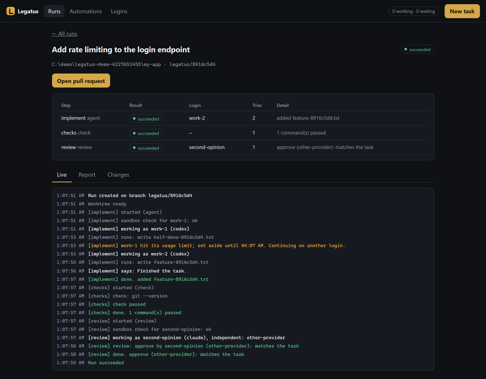

<p align="center">
  
</p>

<h1 align="center">Legatus</h1>

<p align="center">
  <strong>Run coding agents in parallel on your own machine, and keep them working when a login runs out of usage.</strong>
</p>

<p align="center">
  <a href="https://github.com/Mvnshi/legatus/actions/workflows/ci.yml"></a>
  <a href="LICENSE"></a>
  <a href="docs/STATUS.md"></a>
  <a href="https://mvnshi.github.io/legatus/"></a>
</p>

Legatus takes tasks, gives each one its own git branch and worktree, hands it to a coding agent (Codex today,
Claude Code too), runs your checks, has a *different* agent review the change, and leaves you a branch and a
report to read before you merge. If you have more than one subscription, it treats them as a pool: when one
hits its usage limit the half-finished work is saved, another login picks it up, and the rest of the
workflow still runs. If every login is out, the run waits for the first reset and carries on.

<p align="center">
  
</p>

> **Early software.** The core works and is tested, but parts have only been exercised with stand-in agents.
> [`docs/STATUS.md`](docs/STATUS.md) says exactly what has and has not been verified. Please read it before you
> point Legatus at anything you care about.

## Try it in a minute, with nothing installed

```text
legatus demo            # a usage limit is hit mid-task and handled; you watch it happen
legatus serve --demo    # the same, in the web cockpit
```

Download a build for your system from [Releases](https://github.com/Mvnshi/legatus/releases), or with Go 1.26+:

```text
go install github.com/Mvnshi/legatus/cmd/legatus@latest
```

## Use it for real

You need `git` and at least one signed-in agent CLI: the [Codex CLI](https://github.com/openai/codex) or
Claude Code.

```text
legatus doctor                                                   # what is installed, which logins are found
legatus accounts add --id main --provider codex --home default   # use the login Codex already has
legatus accounts add --id second --provider codex                # a second login, in its own folder
legatus accounts login second                                    # you sign in; Legatus never sees a password
legatus run --repo . --check "npm test" --review "add input validation to the signup form"
```

A run's branch is `legatus/<run id>`. Next to it Legatus writes a report (`evidence.md`) that lists which login
did what, the check results, the reviewer's verdict, every usage limit that was hit, anything removed from
prompts, and the files that changed.

### Many tasks at once: the daemon and the cockpit

```text
legatus serve                 # a queue, several runs at once, survives restarts
legatus open                  # the web cockpit, in your browser
legatus queue "add input validation to the signup form" --check "npm test" --review
```

The cockpit shows every run with its steps and which login did what, a live journal, the report, the diff, and
your logins with their limits and a countdown to each reset. You can start, cancel and retry tasks and add
logins from it, and it works on a phone-sized screen. It listens only on your own computer and every request
needs a secret key kept in a file only you can read.

### From a GitHub issue to a pull request

```text
legatus run --issue you/project#12 --review --pr draft --check "go test ./..."
```

`--issue` reads the issue through your signed-in `gh` and gives it to the agent as the problem to solve. Issue
text is written by strangers, so it is fenced off and the agent is told not to take orders from it. `--pr`
pushes the run's branch and opens a pull request with the run's report as its description. Nothing is pushed or
published unless you ask for that run (`--pr`, `legatus pr <run>`, or the cockpit button, which asks you to
confirm).

### Tasks that start by themselves

Standing instructions in `automations.yaml` start runs on a schedule, or when an issue with a label appears:

```yaml
automations:
  - id: weekly-deps
    schedule: weekly mon 09:00
    repo: C:/code/my-app
    prompt: Update the dependencies, fix whatever breaks, and keep the tests passing.
    checks: ["npm test"]
    review: true
    pr: draft
    max_active: 1
  - id: labelled-issues
    github: {repo: you/my-app, label: legatus, every: 10m, authors: [you]}
    repo: C:/code/my-app
    pr: draft
```

A schedule first runs at the next scheduled time, never straight away. **A GitHub watch only accepts issues from
the logins you list under `authors`**, because anyone who could write or label an issue could otherwise steer an
agent on your computer. `legatus automations example` prints a starting file.

## Workflows

A workflow is a short YAML list of steps. The default is one agent step, then your checks, then (with
`--review`) an independent review:

```yaml
name: ship
steps:
  - id: implement
    type: agent
    agent: any                     # any, a provider (codex, claude), or other-than:<step>
  - id: checks
    type: check
    run: ["go test ./...", "go vet ./..."]
    on_fail: {retry_with: implement, max: 2}     # send the failure back to the agent
  - id: review
    type: review
    agent: other-than:implement    # another provider if you have one, else another login
    on_fail: {retry_with: implement, max: 1}
```

## Safety

- **Secrets are removed before anything is stored.** Task text is redacted when a run is created, so the run
  file, the journal and the report (which ends up in pull requests) only hold the redacted text.
- **Agents get a scrubbed environment.** Variables such as `GITHUB_TOKEN` or cloud credentials are not passed on
  unless a step asks for them by name.
- **The agent's own sandbox is checked first.** Legatus asks the agent whether its sandbox can start on this
  machine and stops with a clear message if it cannot, instead of letting a run hang. `--no-sandbox` is an
  explicit choice: the agent then works in the run's own worktree with a scrubbed environment, but can reach
  anything your user account can.
- **Reviewers cannot change the code.** They run read-only, and anything a reviewer touches is reverted. A review
  without a clear verdict hands the run to a person; it is never treated as an approval.
- **Nothing is published on its own.** No branch is pushed and no pull request opened unless you asked for it.
- **Heavy work is limited.** Only one build or test suite runs at a time by default, so a queue of tasks does not
  use up your machine's memory.

Legatus is not an operating-system sandbox. See [docs/STATUS.md](docs/STATUS.md#sandboxing) for what that means.

## Use only your own logins

Spread work across subscriptions you are entitled to use, within each provider's terms. Legatus does not share or
pool anyone else's account, and it never asks for or stores a password: each login lives in its own folder and you
sign in with the agent's own `login` command.

## Learn more

- [How it works](docs/DESIGN.md): the parts, and the decisions behind them.
- [What is verified](docs/STATUS.md): honest status, including what has never been run.
- [Backlog](docs/BACKLOG.md): what is next, written so it can be picked up.
- [Contributing](CONTRIBUTING.md) and [security policy](SECURITY.md).

## Build from source

```text
go vet ./... && go test ./...
go build -o legatus ./cmd/legatus
```

MIT licensed.
